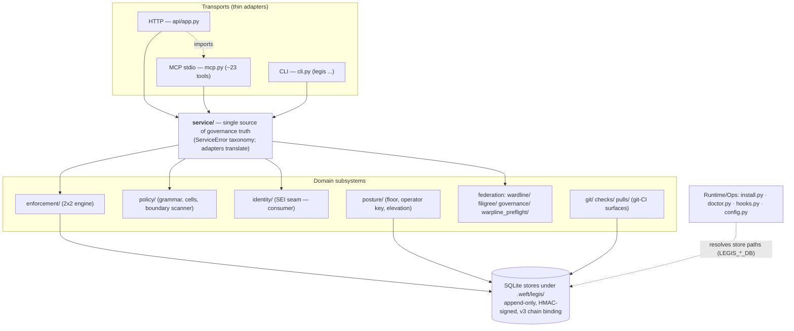
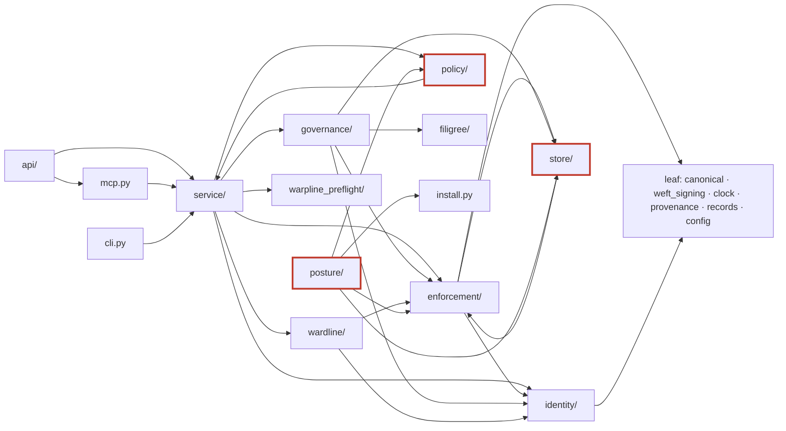
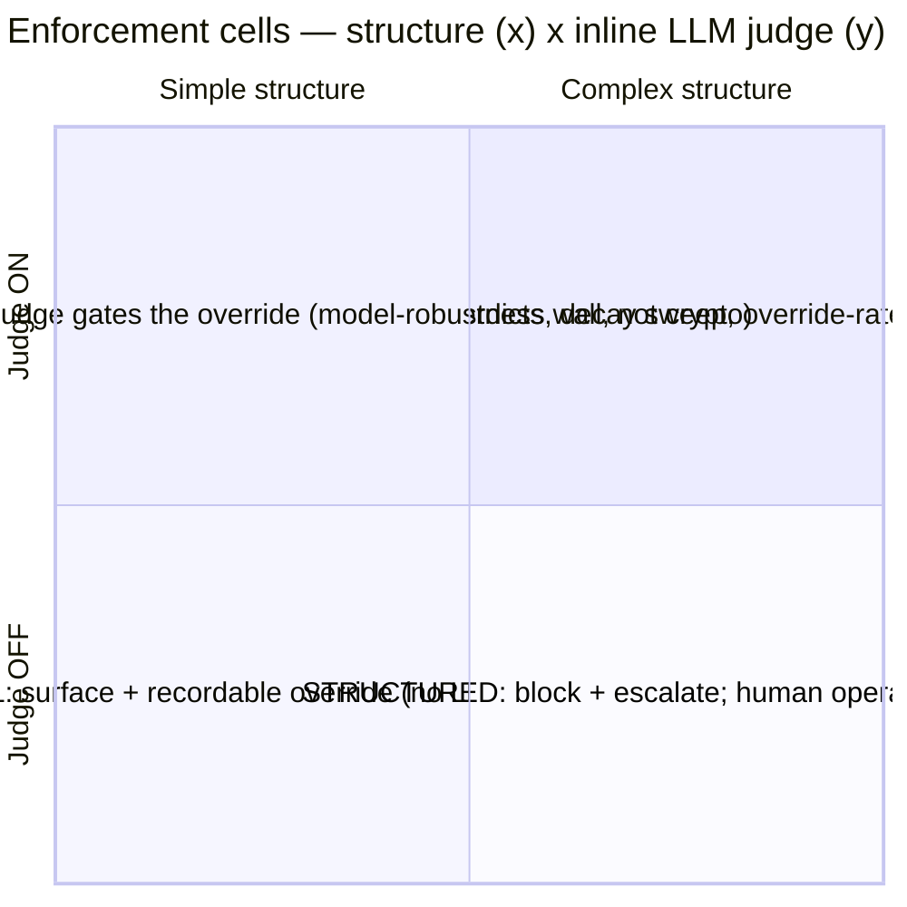
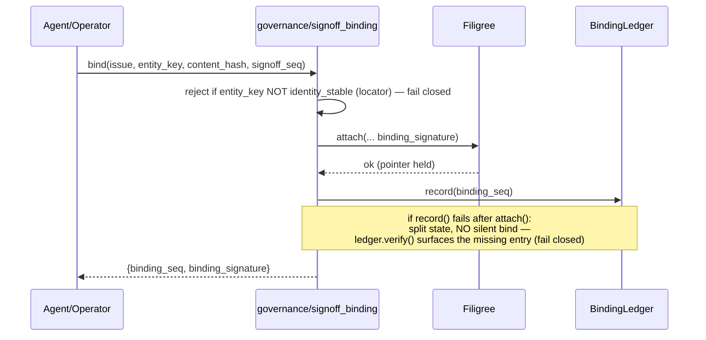

# 03 — Architecture Diagrams (C4 + dependency)

> Mermaid sources. Edges reflect the measured cross-subsystem import matrix (`01-discovery-findings.md` §6); coupling concerns are validated in `temp/validation-catalog.md`.

## C4 L1 — System Context

```mermaid
graph TB
    agent["Coding Agent<br/>(primary customer)"]
    operator["Human Operator<br/>(signs off / posture / keys<br/>— from OUTSIDE the loop)"]
    legis["<b>Legis</b><br/>git/CI + governance layer<br/>(governance-honesty)"]
    forge["Forge<br/>(git / CI / PR / checks)"]
    loom["Loomweave<br/>(SEI authority)"]
    ward["Wardline<br/>(trust/taint analysis)"]
    fil["Filigree<br/>(issue tracking / sign-off)"]
    warp["Warpline<br/>(preflight facts)"]

    agent -->|override / signoff / read attestations / route findings| legis
    operator -->|sign-off, posture floor, key custody| legis
    legis -->|reads branch/commit/PR/check context| forge
    legis -->|resolve_sei / lineage (SEI opaque)| loom
    legis -->|provides rename feed| loom
    ward -->|findings ingested → routed into cells| legis
    legis -->|SEI-keyed sign-off binding / closure gate| fil
    warp -->|advisory preflight facts (never gates)| legis
```

## C4 L2 — Containers (process + persistence)



## C4 L3 — Component: hub-and-adapters with dependency direction



> Red-outlined nodes participate in a validated coupling concern: `store ↔ enforcement` (bidirectional), `policy → service` (inversion; uses a deferred import to dodge a load cycle), `posture → install` (inverted direction). `api → mcp` is the transport-on-transport edge (Q-H2).

## The governance 2×2 (enforcement engine)



## Sign-off binding sequence (fail-closed)


